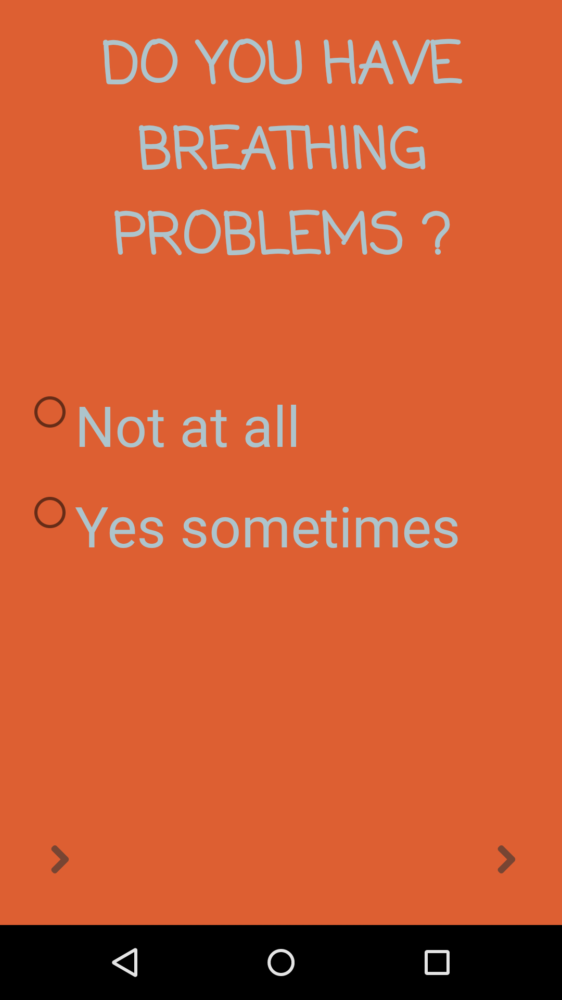

# HeartAttack

It analyses how many of the patients are more likely to have a heart attack if a given set of conditions are true.
- Breathing Problems
- 30 yrs or older
- Is Married to a girl.
- Is Diabetic 
	
If someone has all of the above problems hell 100% have a Hear Attack
Every point has weightage of 25%.

All inputs made shud be stored locally.(SharedPrefs)

You need to do after you make the above.
- Write Tests
- Make logic reuseable 
- Use Transition Animation
- Switch from local to A REST API and also add the api.

# ScreenShots

  
  
  
  
  
  

